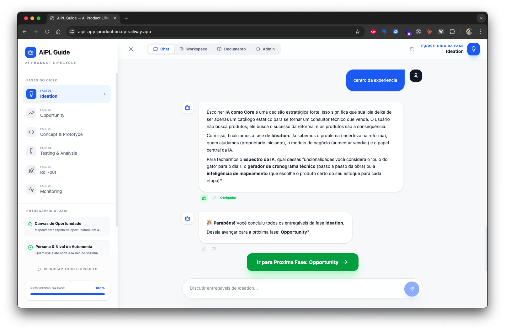
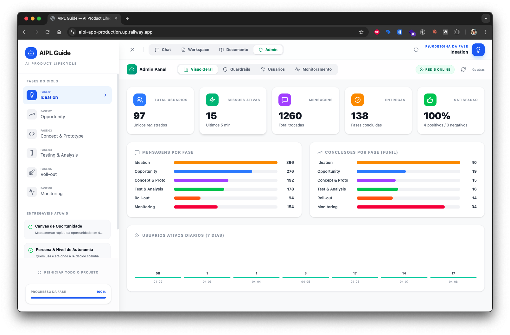

# AIPL — AI Product Lifecycle

> An interactive learning tool that guides you through the complete lifecycle of building AI products, powered by Google Gemini.

Built for [Escola Tera](https://somostera.com)'s AI Product Management course.

### AI Mentor — Chat View
The Gemini-powered mentor guides students through each phase, asking expert questions and auto-filling deliverables from the conversation.



### Admin Dashboard — Real-time Analytics
Monitor usage across all students: sessions, messages, phase completions, guardrail events, and daily active users.



## What is AIPL?

AIPL guides you through 6 phases of AI product development:

1. **Ideation** — Map the opportunity, define users, classify AI level
2. **Opportunity** — Validate with 4 key questions, competitive analysis, data strategy
3. **Concept & Prototype** — Context engineering, agent UX, model & cost
4. **Testing & Analysis** — 4-layer metrics, evaluation plan, risks & guardrails
5. **Roll-out** — Phased rollout (Canary -> Beta -> GA), onboarding
6. **Monitoring** — Observability, continuous improvement cycle

Each phase has 2-4 deliverables. An AI mentor (powered by Gemini) guides you through each one with expert questions and auto-fills deliverables from your responses.

## Architecture

```
┌─────────────┐     ┌──────────────┐
│   React UI  │────▶│  Gemini API  │  (student's own key)
│  (Vite/TS)  │     │  (client)    │
└──────┬──────┘     └──────────────┘
       │
       │ (cloud mode only)
       ▼
┌──────────────┐     ┌─────────┐
│  Express API │────▶│  Redis  │
│  (analytics) │     │         │
└──────────────┘     └─────────┘
```

**Local mode:** React + Gemini only. No backend needed. Data in localStorage.
**Cloud mode:** Full stack with analytics dashboard and session tracking.

## Quick Start (Local)

```bash
git clone https://github.com/lirad/aipl.git
cd aipl
npm install
cp .env.example .env
# Add your Gemini API key to .env
npm run dev
```

Open http://localhost:3000

### Getting a Gemini API Key

1. Go to [Google AI Studio](https://aistudio.google.com/apikey)
2. Click "Create API Key"
3. Copy the key and paste it in your `.env` file as `VITE_GEMINI_API_KEY=your_key_here`

## Deploy to Cloud (Railway)

> **What is Railway?** [Railway](https://railway.com) is a cloud platform that lets you deploy apps with zero DevOps. You connect your GitHub repo, Railway detects the language, builds, and runs it automatically. Think of it as "Vercel for full-stack apps" — you push code, it handles servers, databases, domains, and scaling. Free tier available for learning.

> **What is Redis?** [Redis](https://redis.io) is an in-memory database — extremely fast because it stores data in RAM, not on disk. In AIPL, Redis stores analytics: session tracking, message counts, guardrail events, and latency metrics. It's the backbone of the Admin Dashboard. You don't need Redis for local mode — it's only used in cloud mode.

[](https://railway.com/new/template?template=https%3A%2F%2Fgithub.com%2Flirad%2Faipl&envs=VITE_GEMINI_API_KEY&VITE_GEMINI_API_KEYDesc=Your+Gemini+API+key+from+aistudio.google.com%2Fapikey)

Clicking the button above will:
1. Fork this repo into your Railway account
2. Provision a **Node.js service** (Express + React) and a **Redis database**
3. Ask for your `VITE_GEMINI_API_KEY` (the same key from Google AI Studio)
4. Build and deploy automatically — you'll get a public URL in ~2 minutes

After deployment, you can also set these optional variables in Railway's dashboard:
- `VITE_API_URL` — set to your Railway public URL (enables analytics)
- `ADMIN_KEY` — protects the admin dashboard (any string you choose)

## Tech Stack

| Layer | Technology |
|-------|-----------|
| Frontend | React 19, TypeScript (strict), Vite 6 |
| Styling | Tailwind CSS 4 |
| AI | Google Gemini API (`@google/genai`) |
| Backend | Express.js (cloud mode only) |
| Database | Redis via ioredis (cloud mode only) |
| Animation | Motion (Framer Motion) |
| Icons | Lucide React |

## Project Structure

```
src/
  components/          # UI pieces organized by feature
    chat/              # Chat interface (messages, input, typing indicator)
    phases/            # Phase navigation and onboarding cards
    workspace/         # Deliverable editor with markdown preview
    admin/             # Analytics dashboard (cloud mode)
    ui/                # Shared UI components (ErrorBoundary)
  hooks/               # Custom React hooks
    useChat.ts         # Chat state, AI interaction, deliverable updates
    useDeliverables.ts # Deliverable CRUD with localStorage persistence
    useLocalStorage.ts # Generic typed localStorage hook
  services/            # External integrations
    gemini.ts          # Gemini API client with JSON schema responses
    analytics.ts       # Event tracking (no-op in local mode)
  data/                # AIPL framework content (the curriculum)
    phases.ts          # Phase definitions and deliverables
    prompts.ts         # System prompts and context engineering
    tools.ts           # Curated AI tools per phase
    constants.ts       # Shared constants and configuration
  types/               # TypeScript type definitions
server/                # Express API (cloud mode only)
  routes/              # API endpoints (session, tracking, admin)
  middleware/          # Validation (zod) and rate limiting
  services/            # Redis connection
```

## How the AI Integration Works

This is the most interesting part of the codebase for learning.

### Context Engineering

The system prompt in `src/data/prompts.ts` and `src/services/gemini.ts` demonstrates **context engineering** — the practice of designing everything that goes into an LLM's context window:

- **System prompt** with behavior rules, framework references, and output format
- **Phase-aware context** — previous phase deliverables are injected as context
- **Deliverable status tracking** — the AI knows which deliverables are done/pending
- **JSON response schema** — Gemini returns structured data, not just text

### Structured Output (JSON Schema)

```typescript
// From src/services/gemini.ts
config: {
  responseMimeType: "application/json",
  responseSchema: {
    type: Type.OBJECT,
    properties: {
      text: { type: Type.STRING },
      deliverableUpdates: {
        type: Type.ARRAY,
        items: {
          type: Type.OBJECT,
          properties: {
            id: { type: Type.STRING },
            content: { type: Type.STRING }
          }
        }
      }
    }
  }
}
```

The AI returns both a text response AND structured deliverable updates. This is how deliverables get auto-filled from the conversation.

### Google Search Tool

The Gemini integration uses Google Search as a tool for competitive analysis and market data, demonstrating how to give LLMs access to real-time information.

## Key Design Decisions

| Decision | Rationale |
|----------|-----------|
| CORS intentionally open | Educational project — avoids student frustration |
| Client-side Gemini API | Each student uses their own key, zero cost for the instructor |
| localStorage persistence | Zero-dependency local mode, works offline after initial load |
| Dual deploy mode | Start simple (local), level up (cloud) when ready |
| No auth on local mode | Reduces friction for students learning |
| Admin dashboard exists | Teaches observability — students see how to monitor AI products |

## Contributing

See [CONTRIBUTING.md](CONTRIBUTING.md).

## License

MIT — see [LICENSE](LICENSE).

---

Built with love for Escola Tera by [Lira](https://github.com/lirad)
